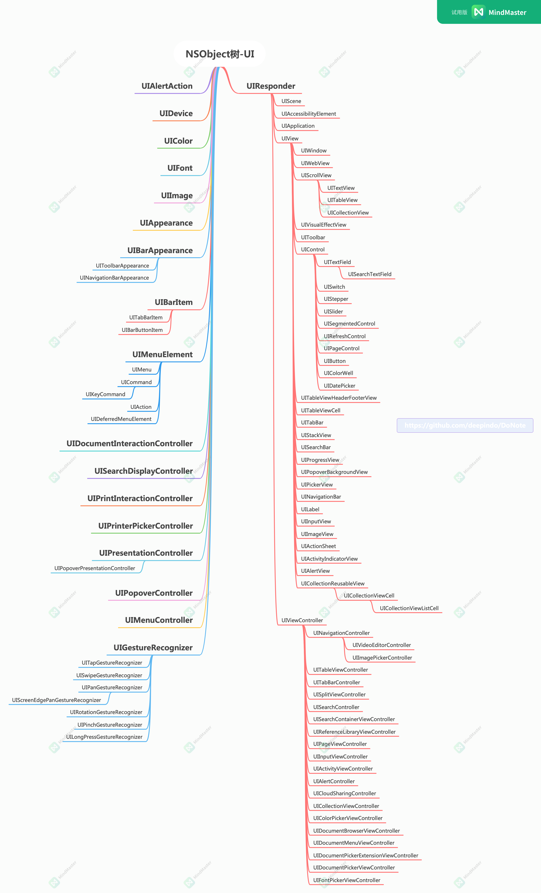

# DoNote

> 持续更新中！！！

- **前言**: 从事iOS开发几年了，一直在业务需求及不同的项目中转动，对于基础知识及一些底层的知识一直不求甚解，期间也多次因为生活中的一地鸡毛，而处于一种惫懒，拖延的恶性循环中，这对于“出身”并不是特别好的开发而言是灾难性的，若是仍不求自救，可能一辈子就这样了。

- **行动**: 在这里从全局的角度将iOS的开发舆图整理出来，然后逐渐补全学习或者整理笔记，不限于iOS，另根据知识整理面试题集，知其然，知其所以然，还得能条理的表达出来。以上作为自己`自救`的一个方式吧！**知行合一**，真正做到很难，0到1的过程，就从这第一步开始吧！

## 一、思维

### 1. C
  - [x] [**c**](https://github.com/deepindo/DoNote/wiki/c) - c的一些基础

### 2. Objc
> 以下仅从宏观上列出主干，详情的objc脉络，请查看[objc总纲](https://github.com/deepindo/DoNote/wiki/iOS-objc%E6%80%BB%E7%BA%B2)
  - [x] [**objc4**](https://github.com/deepindo/DoNote/wiki/iOS-objc4) - objc源码
  - [x] [**struct**](https://github.com/deepindo/DoNote/wiki/iOS-objc.h) - struct分析
  - [x] [**objc**](https://github.com/deepindo/DoNote/wiki/iOS-objc.h) - objc.h
  - [ ] [**NSObject**]() - NSObject.h
  - [ ] [**runtime**]() - runtime.h
  - [ ] [**message**]() - message.h
  - [x] [**Data Structure**](https://github.com/deepindo/DoNote/wiki/%E6%95%B0%E6%8D%AE%E7%BB%93%E6%9E%84) - 数据结构，数据类型
  - [x] [**Memory Management**](https://github.com/deepindo/DoNote/wiki/iOS%E5%86%85%E5%AD%98%E7%AE%A1%E7%90%86) - 内存管理
  - [ ] [**Data Storage**]() - 数据存储
  - [x] [**Property**](https://github.com/deepindo/DoNote/wiki/iOS%E4%BF%AE%E9%A5%B0%E7%AC%A6)
  - [x] [**Block**](https://github.com/deepindo/DoNote/wiki/iOS-Block)
  - [ ] [**Runtime**](https://github.com/deepindo/DoNote/wiki/iOSRuntime)
  - [ ] **objc_msgsend**
  - [ ] [**Runloop**](https://github.com/deepindo/DoNote/wiki/iOSRunloop) 
  - [ ] [**Multithreading**](https://github.com/deepindo/DoNote/wiki/iOS%E5%A4%9A%E7%BA%BF%E7%A8%8B) - 多线程
  - [ ] **Delegate**
  - [ ] **KVO**
  - [ ] **KVC**
  - [ ] **Notification**
  
  - [ ] [**Network**](https://github.com/deepindo/DoNote/wiki/iOS%E7%BD%91%E7%BB%9C) - http, https
  - [x] [**Algorithm**](https://github.com/deepindo/DoNote/wiki/iOS%E7%AE%97%E6%B3%95) - 算法
  - [x] [**Encryption**](https://github.com/deepindo/DoNote/wiki/%E5%8A%A0%E5%AF%86%E7%AE%97%E6%B3%95) - 加密与解密
  - [x] [**Design Patterns**](https://github.com/deepindo/DoNote/wiki/iOS%E8%AE%BE%E8%AE%A1%E6%A8%A1%E5%BC%8F)** - 设计模式.
     
  - [ ] [**UI**](https://github.com/deepindo/DoNote/wiki/iOSUIKit) - UIKit相关的
  - [ ] **Native&JS** - 原生成JS交互
  - [ ] **Third Party** - 第三方库
  - [ ] [**SDKs**](https://github.com/deepindo/DoNote/wiki/iOSSDK%E9%9B%86%E5%90%88) - SDK集合
  - [ ] [**App优化**](https://github.com/deepindo/DoNote/wiki/iOSApp%E4%BC%98%E5%8C%96)
  - [x] [**知识小集合**](https://github.com/deepindo/DoNote/wiki/iOS%E7%9F%A5%E8%AF%86%E5%B0%8F%E9%9B%86%E5%90%88)

### 3. Swift 
  - [ ] **Closure**
  - [ ] **Struct**
  - [ ] **Protocol**
  - [ ] **Extension**
  - [x] **Function** - 系统函数、API
     - [Swift - 高阶函数介绍(map、flatMap、filter、reduce)](https://www.hangge.com/blog/cache/detail_1827.html)
  - [x] **Others**
     - [Swift与JSContext的交互](https://github.com/deepindo/DoNote/wiki/Swift%E4%B8%8EJSContext%E7%9A%84%E4%BA%A4%E4%BA%92)
     - [SwiftTips](https://github.com/DarielChen/iOSTips)

### 4. 跨平台
  - [x] [**Flutter**](https://book.flutterchina.club/chapter1/mobile_development_intro.html#_1-1-2-hybrid%E6%8A%80%E6%9C%AF%E7%AE%80%E4%BB%8B) - [Flutter中文网](https://flutterchina.club/setup-macos/)
  - [x] [**Angular+Ionic**](https://ionicframework.com/docs) - ionic与angular原配的，当然ionic也可以和vue以及react自由组合
  - [ ] **UniApp** - vue自家的
  - [ ] **HBuilder**
  - [ ] **Xamarin.forms**
  - [ ] **ReactNative**

### 5. 前端
  - [ ] **H5**
  - [ ] **Vue**
  - [ ] **Angular**
  - [ ] **React**

### 6. Python

## 二、面试集

1. [iOS面试题大全--(附答案)](https://www.jianshu.com/p/e709fde38de3)
2. [iOSInterviewsAndDevNotes](https://github.com/DevDragonLi/iOSInterviewsAndDevNotes)
3. [全新角度剖析--iOS面试](https://juejin.cn/post/6899689319809286158)
4. [2020-iOS面试题集合](https://github.com/LGCooci/LGiOSQuestions)
5. [iOS 面试宝典 没有比这更全的了（持续更新）](https://www.jianshu.com/p/3b7f3f596bcb)

  
##  三、iOS舆图

iOS学习笔记通过wiki查看: <https://github.com/deepindo/DoNote/wiki>

### iOS基础
#### 布局
1. Autolayout
2. Snapkit
3. Masonry
4. Simplex算法
5. Flexbox
6. AsyncDisplayKit

#### 列表
1. UITableView
2. UICollectionView
3. ExpandableCell
4. Header
5. Placeholder
6. CollectionViewLayout
7. IGListKit

### 图表
1. Charts

#### 图形
1. CoreGraphics
2. Git
3. 图片
4. 图片处理
5. PDF

#### 多媒休
1. 视频
2. 音频
3. 游戏
4. ARKit
5. CoreGraphics
6. CoreImage
7. Metal
8. GPUImage
9. SceneKit
10. Image I/O
11. SiriKit

#### AppService
1. 硬件
2. 定位(CoreLoation)
3. 通知
4. WebView
5. WebScoket
6. iCloud
7. WatchKit
8. 照片
9. 相机
10. 文件管理
11. 手势
12. 键盘
13. 蓝牙
14. NFC
15. ForceTouch
16. iBeacon
17. 地图
18. AppleTV
19. Email
20. PassBook
21. 支付
22. 权限
23. CoreMotion

### iOS系统
#### Foundation

#### 界面
1. UIViewController
2. UINavigationController
3. ScrollView
4. 按钮
5. Label
6. 表单
7. 登录
8. 菜单
9. Navigation Bar
10. Popup
11. 进度条
12. 下拉刷新
13. SegmentedControl
14. Slider
15. SplashView
16. StatusBar
17. Stepper
18. Switch
19. TabBar
20. PickerView
21. 日历
22. 卡片
23. 自定义控件
24. 浮层
25. 弹窗
26. 标签
27. 通知中心
28. Text
29. TextKit
30. UIPageControl
31. CoreText
32. 字体
33. 多窗口
34. 向导

## 三、欢迎提交 PR / issue

- 收集整理不易，且赞且珍惜！如果你觉得此仓库对你有价值，欢迎 star/fork，蟹蟹🤝。

- **Email**: deepindo@foxmail.com, 有需要请联系 

